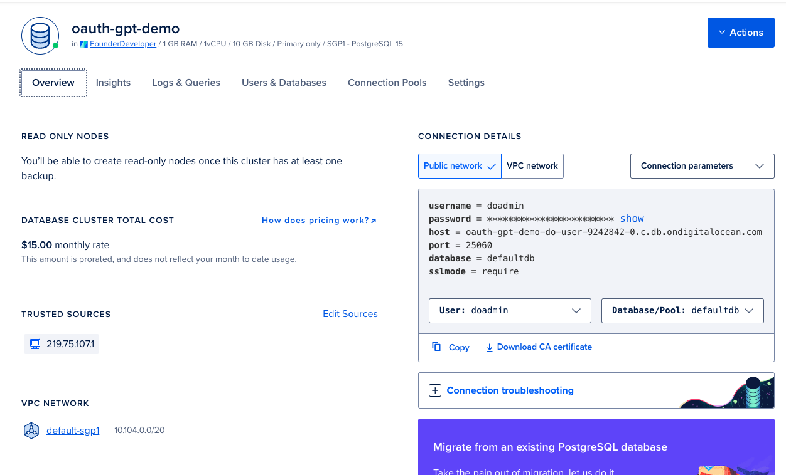
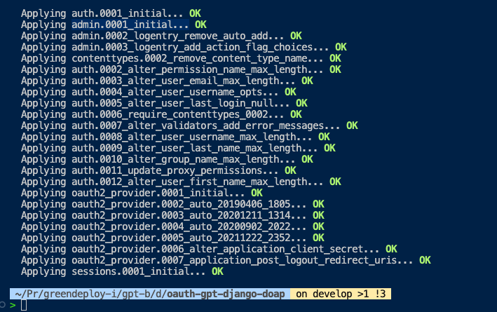

# How to make postgres work in DigitalOcean and for this app

## Why need postgres

Django works best with Postgres.

Also, you need a database to store the various sessions and oauth tokens.

## How to

Each howto is a pre-requisite for the subsequent howto.

You can do your own way to accomplish the same outcome, but if you're a complete newbie, I recommend you follow exactly.

You can also watch the loom here.

Click on the above to get $200 credit over the next 60 days if you don't already have an account.

I have compiled the whole thing as a loom video here.

### How to setup a postgres database in digitalocean

Objective: to have a postgres running

How to tell success: when you have a screen that looks like this in your digitalocean

### How to connect your locally run app to the postgres database in digitalocean

Objective: to have your local app connected to a postgres

How to tell success: when you successfully run `python manage.py migrate` and have a screen that
looks like this in your terminal

1. Update the .env with your database settings
2. Uncomment the database settings in `manage.py`
3.  Run `python manage.py migrate` to execute the migrations (You may have to stop the server using Ctrl+C)